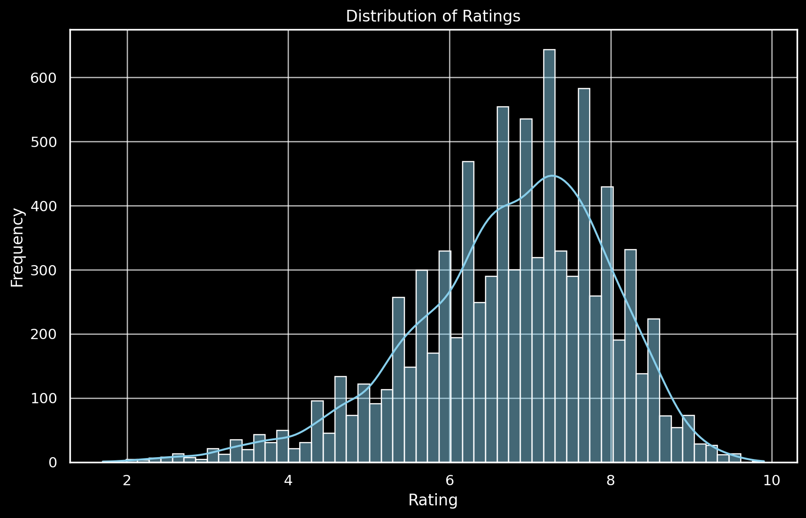
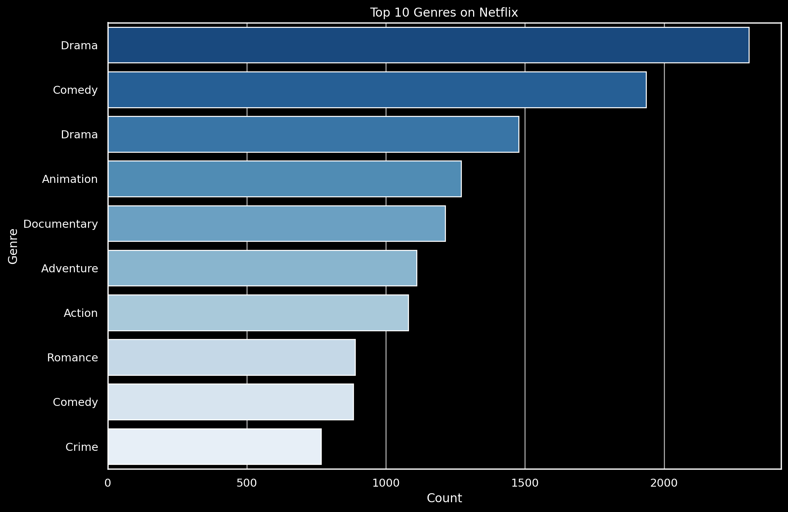
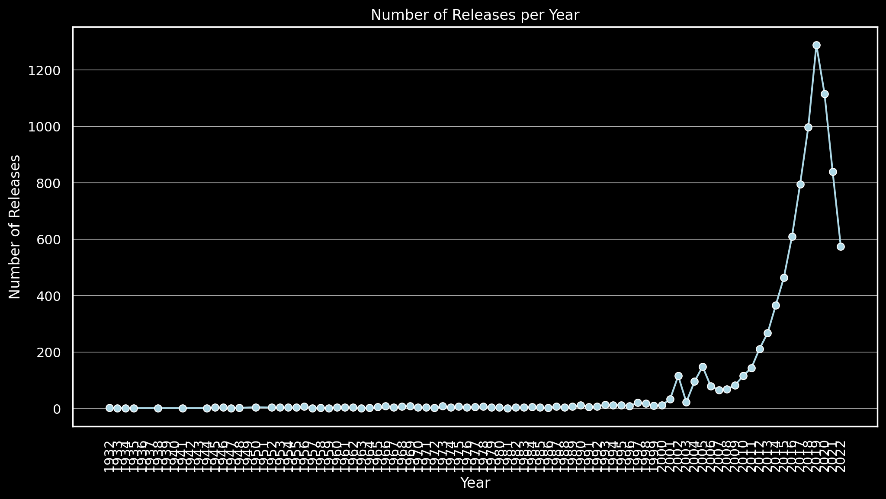
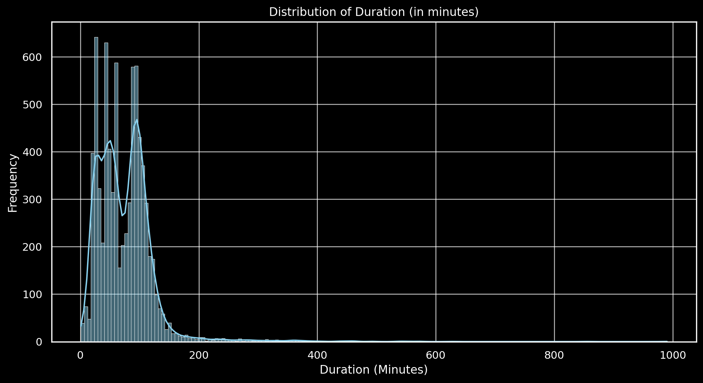

# Netflix Data Analysis

## Dataset Processing for Analysis

### Data Overview and Initial Exploration 🌟
- **Dataset**: Contains Netflix titles with attributes like year, rating, duration, etc.
-- *Datasource: [Kaggle](https://www.kaggle.com/datasets/narayan63/netflix-popular-movies-dataset)*
- **Initial Observation**: Identified data types and missing values.

### Data Cleaning 🧹
- **Missing Values**: Focused on columns 'votes' and 'rating'. Rows with missing values in these columns were dropped.
--    Year: 527 missing.
      Certificate: 3,453 missing.
      Duration: 2,036 missing.
      Genre: 73 missing.
      Rating: 1,173 missing.
      Votes: 1,173 missing.
- **Result**: Ensured crucial data like ratings and votes were complete for reliable analysis.

#### 🔧 Data Cleaning Insights
Missing Values:

    Year: 527 missing.
    Certificate: 3,453 missing.
    Duration: 2,036 missing.
    Genre: 73 missing.
    Rating: 1,173 missing.
    Votes: 1,173 missing.

### Data Transformation 🔧
- **Year Field**: Extracted the first year mentioned and converted it to a numeric format.
- **Votes Field**: Transformed from a string with commas to a numeric format for analysis.
- **Consistency**: Achieved uniformity in data types for key columns.

### Dataset After Cleaning and Transformation 🌟
- **Refined Data**: The dataset now had cleaner and more consistent data, suitable for in-depth analysis.
- **Structure**: Retained essential features with corrected data types and without missing values in critical columns.

## Exploratory Data Analysis (EDA) 🔍

### Distribution of Ratings - Snapshot 📊

- **Central Tendency**: The distribution peaks around a rating of 7, suggesting a **high concentration of favorable ratings**.
- **Skewness**: There is a slight **left skew** indicating more rare low ratings.
- **Variability**: Ratings span from 1 to 10, with **most data clustered around the median**.
- **Fit**: The overlaid curve suggests the data **approximately follows a normal distribution**, with some deviations, especially in the tails.



### Top 10 Genres on Netflix - Popularity Analysis 📉

- **Leading Genre**: **Drama** dominates, with the highest count.
- **Comedy Presence**: **Comedy** appears twice, suggesting possible categorization nuances.
- **Genre Diversity**: A **broad mix** of genres from **Documentary** to **Crime**.
- **Top Three**: **Drama**, **Comedy**, and **Animation** lead in popularity.



### Genre Word Cloud for Content Analysis 🌐

- **Prominent Genres**: **Drama**, **Comedy**, and **Action** stand out as the most frequent.
- **Genre Variety**: Showcases a **wide array** of genres, indicating a **diverse content library**.
- **Visual Impact**: The size of each genre's name correlates with its **relative popularity** or **frequency**.


### Number of Releases per Year - Overview 📈

- **Growth Trend**: Exponential increase in the number of releases over the years.
- **Peak Activity**: A **sharp peak** is observed in the most recent year, highlighting a significant surge in releases.
- **Historical Context**: Historically low activity with a notable **upward trend** starting in the mid-2000s.
- **Data Points**: Consistency in data collection with **yearly data points**.



### Rating vs. Votes - Correlation Analysis 🔍

- **Higher Ratings Concentration**: A **dense cluster** of votes around ratings of 6 to 8.
- **Votes Spread**: Votes are **widely distributed** across ratings, with **diminishing frequency** towards both ends of the rating spectrum.
- **Popular vs. Quality**: Some high-rated content has **fewer votes**, suggesting a mix of **niche quality content** and **popular mainstream content**.


### Distribution of Content Duration - Quick Insights 🎞️

- **Most Common Durations**: Concentrated **peaks around 100 and 200 minutes**.
- **Short-Form Content**: High frequency of content **less than 100 minutes**, indicative of **short films or episodes**.
- **Long-Form Rarity**: A **drop-off** in frequency as duration increases, highlighting the rarity of **extended-duration content**.



## Predictive Modeling: Recommendation System 🤖

### System Setup and Methodology 🛠️

#### Feature Extraction and Similarity Measure
- **Combined Features**: Merged 'genre' and 'description' into one text feature.
- **TF-IDF**: Transformed text data into numerical format for machine learning.
- **Cosine Similarity**: Computed similarity scores between titles.

```python
from sklearn.feature_extraction.text import TfidfVectorizer
from sklearn.metrics.pairwise import cosine_similarity

# Data Preparation
netflix_data_cleaned['combined_features'] = netflix_data_cleaned['genre'].str.cat(netflix_data_cleaned['description'], sep=" ")

# TF-IDF Vectorization
tfidf = TfidfVectorizer(stop_words='english')
tfidf_matrix = tfidf.fit_transform(netflix_data_cleaned['combined_features'].fillna(''))

# Cosine Similarity Matrix
cosine_sim = cosine_similarity(tfidf_matrix, tfidf_matrix)

# Building function to output recommendation titles and their associated index number
def recommend_titles_modified(title, cosine_sim=cosine_sim, df=netflix_data_cleaned, indices=indices):
    # Get the index of the movie
    idx = indices[title].iloc[0]
    sim_scores = list(enumerate(cosine_sim[idx]))
    sim_scores = sorted(sim_scores, key=lambda x: x[1], reverse=True)
    movie_indices = [i[0] for i in sim_scores[1:11]]
    return df['title'].iloc[movie_indices]
```
### Recommendation Function
- **Functionality**: Recommends similar titles based on input title.
- **Usage**: Finds the title's index, calculates similarity scores, and sorts similar titles.

### Function Testing and Validation 🔍
- **Functionality**: Tested with titles like "Breaking Bad", "Brooklyn Nine-Nine", and "Mindhunter".
- **Output**: Successfully generated lists of similar titles.

### Tests and Results 🧪
- **Test 1**: "Breaking Bad"
```python
# Testing the recommendation function with "Breaking Bad"
recommended_titles_for_breaking_bad = recommend_titles_modified("Breaking Bad")
recommended_titles_for_breaking_bad
```
- **Results 1**
```python
Result
9951                                  Breaking Bad
2578                         The Girls at the Back
5106    Quiet Victory: The Charlie Wedemeyer Story
5621                                           Tig
3722                         Live Twice, Love Once
2422                                     Paddleton
3224                                     Kakegurui
2695                                   School 2017
3202                                 Dirty Teacher
9189                                  Russian Doll
Name: title, dtype: object
```

- **Test 2**: "Brooklyn Nine-Nine"
```python
# Testing the recommendation function with "Brooklyn Nine-Nine"
recommended_titles_for_brooklyn_nine_nine = recommend_titles_modified("Brooklyn Nine-Nine")
recommended_titles_for_brooklyn_nine_nine
```
- **Results 2**
```python
Result
1270                      The Good Cop
4071                     Blood Brother
1589                          Teachers
6000                     Heroes Wanted
6                       Rick and Morty
1204                  More the Merrier
171                       Line of Duty
210                        Derry Girls
132     CSI: Crime Scene Investigation
2761          Murder Among the Mormons
Name: title, dtype: object
```
### Conclusion

#### Overview of the Recommendation System 🌟

The recommendation system developed for the Netflix dataset effectively utilizes content-based filtering techniques. By integrating features like genres and descriptions, the system provides personalized recommendations that align closely with user preferences and content similarity.

#### Key Takeaways 🗝️

- **Effective Feature Utilization**: The combination of genre and description into a single feature vector proves to be efficient in capturing the essence of each title.
- **TF-IDF and Cosine Similarity**: These methods successfully transformed and compared textual data to compute similarity scores, forming the backbone of the recommendation logic.
- **Versatile Recommendations**: The system demonstrated its capability to suggest relevant titles across various genres, as seen in the test cases with "Breaking Bad" and "Brooklyn Nine-Nine".

#### Future Enhancements 🔮

- **Incorporate More Features**: Including director, cast, and user ratings could further refine the recommendations.
- **User Feedback Integration**: Implementing a feedback loop to adjust recommendations based on user interactions.
- **Scalability and Performance**: Optimizing the system for larger datasets and real-time recommendations.

#### Final Thoughts 💭

The recommendation system stands as a testament to the power of machine learning and data science in enhancing content discovery and user experience. It showcases how a well-structured analysis and thoughtful implementation can lead to tools that not only understand but also predict user preferences.
